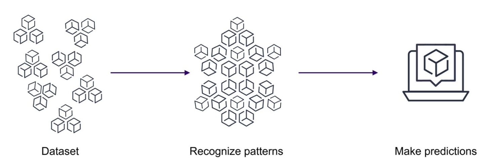
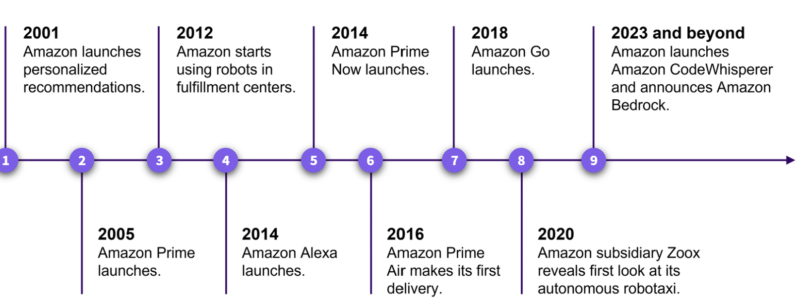
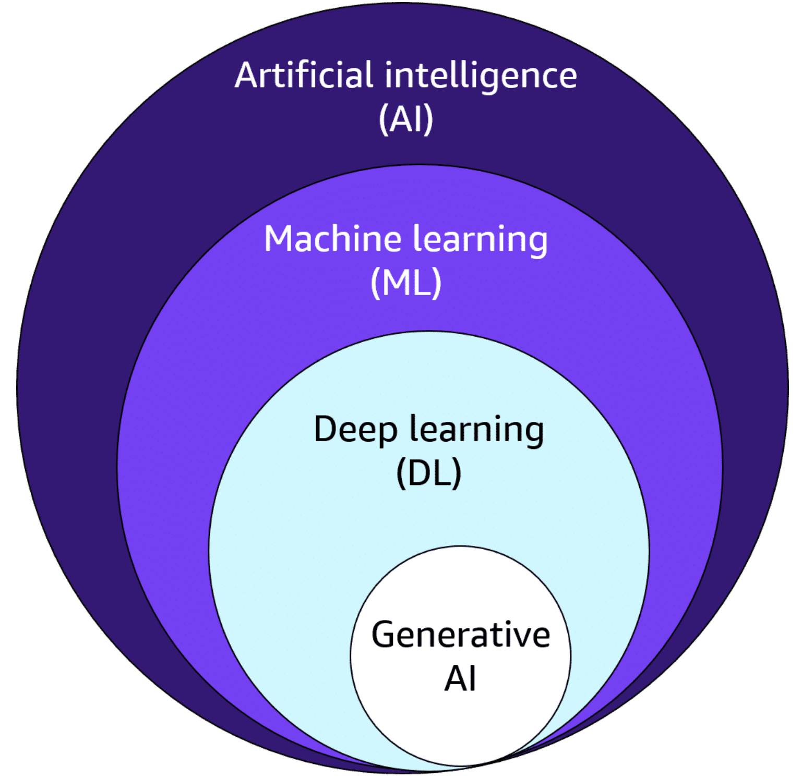
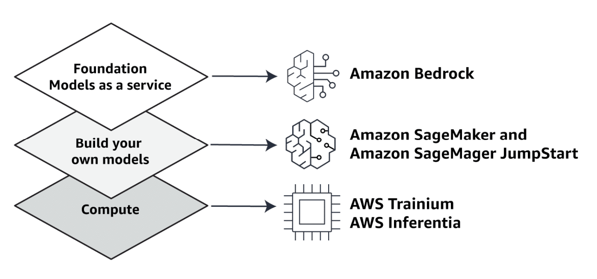
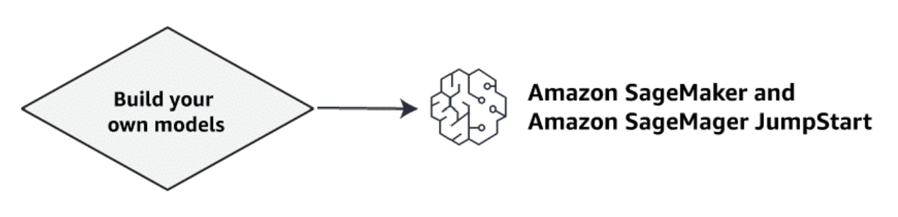

# Generative_AI

## Importatnt tips when it comes to crafting your prompts:

- Provide good **context**; giving examples and information about what you're trying to achieve
- Be **specific**; if it's for a certain audience, say that
- **Break down** the problem
- Be **clear** in how you ask your questions. If something comes back that doesn't sound right, clarify it
- **Rephrase** and **refine** for your prompts

## Best Practices for Prompt Engineering with GitHub Copilot

- Provide high-level context followed by more detailed instructions
- Provide specific details
- Provide examples
  - Zero-shot learning
  - One-shot learning
  - Few-shot learning
- Iterate your prompts
- Keep a tab opened of relevant files in your IDE
- Give your AI assistant an identity
- Use predictable patterns
- Use consistent, specific naming conventions for variables and functions that describe their purpose
- Use good coding practices

## LLM Prompt Engineering Patterns

### Scaffolding Pattern

The Scaffolding Pattern is a design pattern that improves the quality of Large Language Model (LLM)-generated responses by providing a clear structure and guiding the AI towards the desired information. It involves breaking down a prompt into smaller, more focused questions or instructions, which helps maintain focus and coherence in the AI's response. Benefits of the Scaffolding Pattern include improved clarity and structure, enhanced precision, and reduced ambiguity.

The Scaffolding Pattern is effective in generating well-structured and informative responses. By breaking down prompts into smaller, focused components, you can guide the AI more effectively towards the desired outcome, making your experiences with LLMs more fruitful and productive.

### Redirection Pattern

The Redirection Pattern is a design pattern that helps guide AI-generated responses towards desired outcomes by refining, rephrasing, or adding constraints to prompts. This improves relevance, enhances focus, and provides greater control over the AI's output. It's useful for steering the AI away from off-topic, vague, or unsatisfactory responses. The Redirection Pattern is a valuable tool in a prompt engineer's toolkit, ensuring AI-generated content aligns with user needs and expectations.

### Multi-Step Pattern

The Multi-Step Pattern is a design pattern for interacting with Large Language Models (LLMs) that facilitates dynamic, conversational exchanges. It involves a series of prompts and responses, emulating natural conversation, where each prompt builds upon previous responses. This pattern offers several benefits, including enhanced interactivity, progressive refinement, and flexibility. Examples of the Multi-Step Pattern in action include progressively exploring subtopics, like mobile responsiveness in website user experience, or obtaining more detailed information, such as building a reading list on renewable energy. Overall, the Multi-Step Pattern enables more effective, engaging, and adaptable interactions with AI.

### Constraint Pattern

The Constraint Pattern is a design pattern that helps control AI behavior and mitigate biases in Large Language Models by setting explicit boundaries in the prompt. It provides controlled output, bias mitigation, and customization. By specifying instructions or limitations, you can ensure the AI-generated content aligns with your requirements and ethical guidelines. Applying the Constraint Pattern results in more responsible and satisfying interactions with AI, making it an essential part of any prompt engineer's toolkit.

### Act As Pattern

The Act As Pattern is a design pattern that leverages the versatility of Large Language Models (LLMs) by instructing them to adopt alternate personalities or roles. This pattern offers benefits such as versatility, engagement, and customization. By explicitly instructing the AI to assume a specific identity, users can create engaging and diverse interactions that cater to various use cases and creative goals. Examples include adopting the role of a life coach, job interviewer, or even historical characters like Leonardo da Vinci. The Act As Pattern enables users to unlock the full potential of LLMs and elevate AI experiences.

### Data Pattern

The Data Pattern is a design pattern that leverages the capabilities of Large Language Models (LLMs) to analyse and process structured data, such as JSON or CSV. By providing structured data and a specific prompt, the Data Pattern allows the AI to offer insights, visualisation advice, and generate code for visual representations. Key benefits of the Data Pattern include enhanced data analysis, visualisation advice, and code generation, making it an invaluable tool in the prompt engineer's toolkit. It helps streamline the data analysis process, improve data comprehension, and save time and effort, ultimately unlocking the full potential of LLMs in data analysis and visualisation.

### Fallback Pattern

The Fallback Pattern is a design pattern that helps you manage unexpected or unsatisfactory responses from Large Language Models (LLMs). It involves using alternative approaches or contingency plans when the AI's output doesn't meet your expectations. This can include rephrasing prompts, providing more context or constraints, using the Multi-Step Pattern, or even switching to a different AI model or solution. Benefits of the Fallback Pattern include adaptability, resilience, and continuous improvement. By employing the Fallback Pattern, you can maintain control, adapt to unforeseen challenges, and refine your strategies when working with LLMs.

### Combining Patterns

Combining design patterns can enhance LLM interactions. Benefits of combining patterns include improved effectiveness, greater versatility, and enhanced customization. Combining patterns allows you to leverage multiple aspects of the AI's capabilities for more robust and effective prompts. For example, combining the Constraint and Act As Patterns results in AI-generated advice that is role-specific and grounded in the set boundaries. Experimenting with pattern combinations is essential for prompt engineers, as it helps maximize LLM capabilities and create better outcomes.

### Handling Ambiguous Prompts

When working with LLMs, it's vital to address ambiguous prompts to achieve accurate and relevant results. Strategies include being specific and clear, using examples, employing constraints, leveraging design patterns, iterating and refining, experimenting with prompt phrasings, and embracing AI uncertainty. By mastering these strategies, you can better utilize LLMs and create effective AI interactions.

# Introduction to Generative AI - Art of the Possible

## Overview of ML

Generative artificial intelligence (generative AI) is a branch of machine learning (ML). It is concerned with the development of algorithms that can create natural language text, images, code, audio, or videos based on user input. Generative AI has numerous applications in various industries, such as media, entertainment, healthcare, and finance. In this section, you will learn about the relationship between ML and generative AI. You will also get an introduction to generative AI and how businesses are deriving business value from the use of generative AI.

### What is ML?

To better understand generative AI, it’s important to have an understanding of ML. You might be asking yourself, “how do machines learn?” In essence, ML is training a computer to recognize patterns in historical data to make predictions on new data. These predictions are then used to take business actions.

In practice, ML progresses as follows:

A dataset is used to train a model. In this dataset, there are features and labels. The goal is to take the features as inputs and find a formula that predicts the labels, or outputs. The resulting ML algorithms can take new data, recognize patterns in the data, apply the formula, and make predictions about the data.

**In essence, ML is training a computer to recognize patterns in historical data to make predictions on new data.**

### History of ML at Amazon

You might be surprised to learn that AI and ML have been a focus for Amazon for more than 20 years. Many of the Amazon services customers use are driven by ML. Our ecommerce recommendations engine is driven by ML. The paths that optimize robotic picking routes in our fulfillment centers are driven by ML. Our supply chain, forecasting, and capacity planning are informed by ML.

Amazon Prime Air (drone delivery) and the computer vision technology in Amazon Go (a physical retail store without formal check out experience) use deep learning (DL). Amazon Alexa, powered by more than 30 different ML systems, helps customers billions of times each week to manage smart homes, shop, get information and entertainment, and more.

We have thousands of engineers at Amazon committed to ML, and it’s a big part of our heritage, current ethos, and future. For an accessible version of the following timeline, choose the interactive markers.

### Understanding the difference between geneerative AI and traditional ML

Generative AI is a subset of deep learning because it can adapt models built using deep learning, but without retraining or fine tuning. Deep learning uses the concept of neurons and synapses similar to how our brain is wired. An example of a deep learning application is Amazon Rekognition which can analyze millions of images, streaming and stored videos within seconds. Amazon CodeWhisperer, an example of a generative AI application, can generate code suggestions in real time based on your comments and existing code.

Generative AI is powered by large language models that are pretrained on internet-scale data, and these models are called foundation models (FMs). With FMs, instead of gathering labeled data for each model and training multiple models as in traditional ML, customers can adapt the same FM to perform multiple tasks.

The large language models (LLM) have the ability to predict the next word in a sentence by taking into consideration the position and the context of a word in a sentence. LLMs use this ability to generate new content

**Generative AI is a subset of deep learning because it can adapt models built using deep learning, but without retraining or fine tuning.**

### Evolution of ML and the emergence of generative AI

Machine learning has been around for decades and the data scientists have been building language models for many years. And that begs the question, what has led to the emergence of generative AI right now?

- Investment in team size
- Willingness to invest in big ideas
- Investment in compute

The answer is as straightforward as huge investments in resources. Hiring a large team, spending on compute resources, and importantly, having the willingness to invest and develop big ideas, are all contributors to the rise of generative AI.

## Basic of Generative AI

### What is generative AI?

Generative AI is a type of AI that can create new content, including conversations, stories, images, videos, music, and code.

Generative AI applications have captured our attention and imagination. Customers across industries are rapidly adopting ML technologies to transform their businesses. Many are reinventing customer experiences and applications with generative AI.

Like all artificial intelligence, generative AI is powered by ML models. However, generative AI is powered by very large models that are pretrained on vast collections of data. There will be an in-depth discussion on these models in another course, but for now, the following example explains how customers are using generative AI today.

### Code generative example

An example of generative AI that businesses are using is Amazon CodeWhisperer, the AI coding companion. CodeWhisperer is a generative AI tool that increases developer productivity by generating code.

Developers are often forced to break their workflow to search the internet or to ask their colleagues for help completing a task. Although this can help them obtain the starter code they need, it’s disruptive. They must leave their integrated development environment (IDE) to search or ask questions in a forum or to find and ask a colleague—further adding to the disruption. Instead, CodeWhisperer meets developers where they are most productive, providing real-time recommendations as they write code or comments in their IDE.

### Common use cases

Generative AI is forecasted to increase the global gross domestic product (GDP) by $7 trillion over the next 10 years (Goldman Sachs 2023). You can apply generative AI across all lines of business, including engineering, marketing, customer service, finance, and sales. You can also apply it to many use cases, from text summarization to image generation.

#### Improve customer experience

You can use generative AI to improve customer experience through capabilities such as chatbots, virtual assistants, intelligent contact centers, personalization, and content moderation. Media companies, like Omnicom Group Inc., are building the next generation of tools with AWS for many of these use cases.

#### Boost employee productivity

You can boost your employees’ productivity with generative AI powered conversational search, content creation, text summarization, and code generation, among others. Customers, like Accenture, are driving game-changing productivity increases for their developers with CodeWhisperer.

Business users spend a lot of time extracting data and insights from a dashboard to create presentations for other stakeholders. Amazon QuickSight leverages the power of generative AI to generate, customize, and share compelling visual narratives using natural language prompts, thereby increasing business user productivity.

#### Creativity

You can use generative AI to turbocharge production of all types of creative content, from art and music to text, images, animations, and video.

#### Improve business operations

Finally, you can use generative AI to improve business operations with intelligent document processing, maintenance assistants, quality control and visual inspection, and synthetic training data generation.

### How Amazon uses generative AI

One of the ways Amazon is using generative AI is with the Create With Alexa feature. Create With Alexa uses advances in conversational and generative AI to empower young storytellers to build unique stories with a narrative arc, colorful graphics, and fun, complementary background music. The animated stories then come to life on the screen of Amazon Echo Show devices.

To build these stories, Alexa researchers created several different content generators using generative AI.

## Generative AI use cases

Amazon is focused on three macro layers to generative AI: compute, build your own models, and FMs.

### Compute

First there is the compute required to run large language models (LLMs). Amazon has two specialized chips for this very purpose. Details are as follows:

- AWS Inferentia and AWS Trainium are purpose-built ML accelerators that AWS designed from the ground up.
- The first-generation of AWS Inferentia delivers significant performance and cost-savings benefits for deploying smaller models. AWS Trainium and AWS Inferentia2 are built for training and deploying ultra-large generative AI models with hundreds of billions of parameters.

### Build your own models

Next, you can build your own models using Amazon SageMaker Jumpstart. Details are as follows:

- You can use Amazon SageMaker along with the purpose-built AWS Trainium chip to train your own LLMs.
- Alternatively, choose one of the language models available in SageMaker Jumpstart and retrain it with your own data.

### Foundation Model

Finally, there are the models themselves. FMs with billions of parameters require time and resources to pretrain. Why build your own FM when you can take advantage of the leading FMs already on the market? Considerations are as follows:

- Amazon Bedrock is a fully managed service that makes FMs, including Amazon Titan models, from leading AI startups and Amazon available through an API. Customers can choose from a wide range of FMs to find the model that is best suited for their use case.
- Amazon Bedrock is the most efficient way to build and scale generative AI applications with FMs.

**You can use generative AI to come up with creative and unique names for your products.**

### Use cases for businesses

Generative AI has the potential to bring about sweeping changes to the global economy. Goldman Sachs estimates that about two-thirds of US occupations will be enhanced by AI. AI will likely drive the creation of new jobs and the emergence of new occupations for the vast majority of long-run employment growth.

The future forecasts to be a period of intense experimentation. We expect new architectures to arise in the future, and this diversity will set off a wave of innovation. Generative AI will play a transformational role in every industry.

#### Healthcare

Generative AI contributes to healthcare in the following ways:

- **AWS HealthScribe**: empowers healthcare software vendors to build clinical applications that automatically generate clinical notes by analyzing patient-clinician conversations.
- **Personalized medicine**: By generating treatment plans based on a patient's specific genetic makeup, lifestyle, and disease progression, AI can contribute to more effective, personalized care.
- **Medical imaging**: AI can enhance, reconstruct, or even generate medical images, like X-rays, MRIs, or CT scans, which can aid in better diagnosis.

#### Life sciences

Generative AI contributes to life sciences in the following ways:

- **Drug discovery**: AI can generate new potential molecular structures for drugs, accelerating the process of drug discovery and reducing costs.
- **Protein folding prediction**: AI can predict the 3D structures of proteins based on their amino acid sequence, which is crucial for understanding diseases and developing new therapies.
- **Synthetic biology**: AI can generate designs for synthetic biological systems, such as engineered organisms or biological circuits.

#### Financial services

Generative AI contributes to financial services in the following ways:

- **Fraud detection mechanisms**: Generative AI can help create synthetic datasets to improve AI/ML systems by simulating various money-laundering patterns.
- **Portfolio management**: Generative AI can simulate various market scenarios and help in the creation and management of robust investment portfolios.
- **Debt collection**: AI can generate the most effective communication and negotiation strategies for debt collection, increasing the rate of successful collections.

#### Manufacturing

Generative AI contributes to manufacturing in the following ways:

- **Product design**: Generative AI can be used to create new product designs based on set parameters and constraints. It can generate multiple design options and optimize for factors like cost, materials, performance, and so forth.
- **Process optimization**: AI can generate the most efficient production processes by modeling different scenarios and optimizing for variables such as cost, time, resource usage, and so forth.
- **Preventative maintenance**: By analyzing historical production data, AI can predict maintenance schedules that will provide the most efficient machine outputs and reduce downtimes.
- **Material science**: AI can help generate new material compositions with desired properties.

#### Retail

Generative AI contributes to retail in the following ways:

- **Pricing optimization**: Generative AI can model different pricing scenarios to determine optimal pricing strategies that maximize profits.
- **Virtual try-ons**: AI can generate virtual models of customers for virtual try-ons, improving the online shopping experience.
- **Store layout optimization**: AI can generate the most efficient store layouts to improve the customer shopping experience and boost sales.
- **Product review summaries**: AI can generate review summaries for products so consumers can quickly find pertinent information.

#### Media and entertainment

Generative AI contributes to media and entertainment in the following ways:

- **Content generation**: Generative AI can be used to create scripts, dialogues, or even complete stories for films, TV shows, and games.
- **Virtual reality**: Generative AI can create immersive and interactive virtual environments for games or simulations.
- **News generation**: AI can generate news articles or summaries based on raw data or events.

## Generative AI in Practice

This lesson describes a real-world scenario about how generative AI can benefit customers like you. In the following lesson, you will learn more about the risks and benefits of generative AI.

### Generative AI scenario

In the following example, you will follow AnyCompany, an established shoe brand that is planning to introduce a new comfortable walking shoe to their product line.

#### Content summarization transcript

**Prompt**

Please use this detailed market research report to generate a high-level summary and analysis of the current landscape to be used in a presentation to the executives.

**Output**

Based on our market research, the walking shoe sector has grown by 12 percent over the past year, showing an increase in consumer demand for comfort and functionality. Our data indicates a strong preference among consumers aged 25–45 for shoes that can be used in a work environment while remaining comfortable and durable. Surveys also revealed a rising trend toward health-conscious choices, with 63 percent of respondents indicating their preference to walk to their workplace if presented with supportive footwear. Given these trends, our new comfortable walking shoe can tap into a significant market demand.

#### Content generation transcript 1

**Prompt**

Write a product description to be used as website copy for a shoe that is good for walking around London with the following details and materials: comfortable, durable, mesh fabric, rubber sole, reflective safety feature.

**Output**

Experience the comfort and durability of the London Walker shoe, perfect for all your walking adventures around the city. The upper is made from breathable mesh fabric to keep your feet cool and ventilated on hot summer days. The rubber outsole provides excellent traction and grip on the uneven cobblestone streets. Added reflective details on the side panels and heel provide enhanced visibility and safety for walking at night or in low light conditions.

#### Content generation transcript 2

**Prompt**

Write a product announcement to be used on social media based on the previous details.

**Output**

Looking for a new pair of shoes? Look no further than the London Walker! This stylish and comfortable shoe is perfect for all your walking adventures around the city. With breathable mesh fabric, a rubber outsole, and reflective details, the London Walker will keep you safe and comfortable all day long.

#### Content generation transcript 3

**Prompt**

Stylize this photo as a product photo with a background in London.
The model quickly generates a stylized photo, and it’s off to marketing.

**Output**

[Photo of a shoe with London in the background.]

#### Code generation transcript

The new shoe has been on the market for a little over a week. The product team wants to understand how the readers are reacting to the social media post. They have the sentiment data and want to upload that data to an Amazon Simple Storage Service (Amazon S3) bucket. They can use an AI-coding assistant, such as Amazon CodeWhisperer to generate a Python script that will upload the sentiment data to an S3 bucket.

**Prompt**

Create a Python script to upload files to Amazon Simple Storage Service (Amazon S3).
CodeWhisperer generates the code in a matter of seconds.

**Output**

[Show code generation on screen.]

#### Question and answer transcript

The team has worked with developers to introduce a new AI chatbot on the website. They have fine-tuned the model by training it on the various product lines and the customer database. The enhanced customer experience provides a personal touch to the customer and also saves the business on call center time and expenses. The customer can prompt the chatbot with questions like the following.

**Prompt (from customer)**

Hello, I need some assistance with finding the tracking number for my most recent order.
[Output begins to appear on screen.] The fine-tuned model can access the customer's order information and provide that right in the chat window.

**Output**

Hi John, I see that you ordered the London Walker on July 8, 2023. The expected delivery date is tomorrow, July 12, 2023. Here is the tracking number for your records and reference: 123456789.

## Risks and Benefits

### Evaluating the benefits and risks of generative AI

With the accelerated adoption and increased reach of generative AI, social and legal risks are growing too. You should also consider operational risks because of a single point of failure or inconsistent outputs. You can establish AI principles to prevent harm, audit systems, gain trust, and meet regulatory requirements.

#### What are some possible risks with generative AI?

Ease of use also brings possible risks. For more information review the following three risks.

- **Regulatory requirements**: For example, content that potentially violates another individual's intellectual property is a regulatory concern.
- **Social risks**: For example, the possibility of unwanted content that might reflect negatively on your organization is a social risk.
- **Privacy concerns**: For example, the information shared with your model can include personal information and can potentially violate privacy laws.

**Generative AI carries a great deal of responsibility. It is up to developers, researchers, and users to make sure it is used in an ethical, responsible, and beneficial way.**

#### What are some benefits of generative AI?

The benefits businesses can realize from generative AI are just now coming to the market. For more information review the following four benefits.

- Personalize customer interactions.
- Generate novel content.
- Efficiently adapt pre-built models to business use cases.
- Achieve productivity gains through automation.

As mentioned earlier, businesses are using generative AI to quickly produce content for consumer consumption faster than ever before.

Marketing teams can quickly perform A/B testing on product images with different color sets and backdrops. They can target different audiences more effectively on social media outlets and create custom animations in a fraction of the time compared to using traditional methods. They can also send written copy quickly to various press outlets.

Developers can use CodeWhisperer to generate routine code blocks and implement third-party APIs. This can increase productivity and improve overall performance by accelerating coding and reducing development efforts. This is a giant leap forward in developer productivity, and we believe this is only the beginning. It has the potential to make entire engineering organizations more productive.
